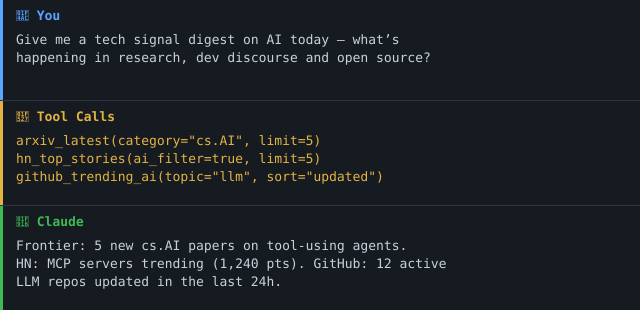

> 🇨🇭 **Part of the [Swiss Public Data MCP Portfolio](https://github.com/malkreide)**

# 📡 hn-tech-signal-mcp


[](https://opensource.org/licenses/MIT)
[](https://www.python.org/downloads/)
[](https://modelcontextprotocol.io/)
[](https://github.com/malkreide/hn-tech-signal-mcp)


> MCP server for global tech & AI signal intelligence — aggregates HackerNews, arXiv, Lobste.rs and GitHub into a structured briefing. No API key required.

[🇩🇪 Deutsche Version](README.de.md)

### Demo



---

## Overview

**hn-tech-signal-mcp** turns any AI assistant into a proactive tech intelligence analyst. The server aggregates four signal layers — research frontier, developer discourse, curated signal, and open-source practice — into a single, structured briefing.

**No authentication required.** All four data sources are public APIs. Optional: set `GITHUB_TOKEN` for higher GitHub rate limits (5,000 req/h vs. 60 req/h unauthenticated).

**Anchor demo query:**
*"Give me a tech signal digest on AI today — what is happening in research, developer discourse and open source?"*

---

## Signal Architecture

```
FRONTIER    arXiv API      → Latest AI/ML papers (cs.AI, cs.LG, cs.CL, cs.CV)
DISCOURSE   HackerNews     → Six feeds + Algolia search + comment threads
            Lobste.rs      → Curated, lower-noise tech signal
PRACTICE    GitHub Search  → What engineers are actually building right now
            HN Show HN     → What individuals are shipping this week
```

Think of the four layers as a radar: arXiv shows what's coming over the horizon, HN and Lobste.rs show what practitioners are discussing, and GitHub shows what teams are actually shipping.

Within the discourse layer there are two levels of depth. The feeds and the search tell you *what* is being discussed; `hn_discussion` tells you *what is actually being argued* — the counter-arguments and the "we tried this in production" replies that carry the real signal.

---

## Features

- 🔬 **Research frontier** – Latest arXiv papers by category (cs.AI, cs.LG, cs.CL, and more)
- 🔍 **arXiv full-text search** – Find papers by keyword, title, or author
- 🗣️ **HackerNews feeds** – top, best, new, Ask HN, Show HN and YC job posts
- 🔎 **HackerNews search** – Full history via Algolia, with date range filter
- 💬 **HackerNews comment threads** – Read the actual discussion under a story, nested, with a bounded fetch budget
- 🔧 **Lobste.rs hottest** – Curated developer signal, filterable by tag
- 🛠️ **GitHub trending AI repos** – Search by topic, stars, sort by activity or popularity
- 📋 **Tech signal digest** – One-call cross-source briefing in Markdown
- ☁️ **Dual transport** – stdio for Claude Desktop, Streamable HTTP for cloud deployment

| # | Tool | Source | Description |
|---|---|---|---|
| 1 | `hn_top_stories` | HackerNews | Six feeds: top/best/new/ask/show/job, with score filter |
| 2 | `hn_search` | HN Algolia | Full-text search across all HN history |
| 3 | `hn_discussion` | HackerNews | Nested comment thread under a story |
| 4 | `arxiv_latest` | arXiv | Latest papers by category (cs.AI etc.) |
| 5 | `arxiv_search` | arXiv | Search papers by keyword/title/author |
| 6 | `lobsters_hot` | Lobste.rs | Curated tech stories, filterable by tag |
| 7 | `github_trending_ai` | GitHub | Trending AI repos by topic and stars |
| 8 | `tech_signal_digest` | All sources | Aggregated Markdown briefing |

### HackerNews feeds

| Feed | Content | Upstream size |
|---|---|---|
| `top` | Front page as ranked right now | 500 items |
| `best` | Highest-voted recent stories | 200 items |
| `new` | Newest submissions, unfiltered | 500 items |
| `ask` | Ask HN — what practitioners are stuck on | ~30 items |
| `show` | Show HN — what people are shipping | 200 items |
| `job` | YC portfolio job posts (`type: "job"`, no comments, score always 1) | ~30 items |

`ask` and `job` are short feeds upstream, so a large `limit` may return fewer stories than requested.

---

## Prerequisites

- Python 3.11+
- `uv` or `pip`
- No API key required
- Optional: `GITHUB_TOKEN` for higher GitHub rate limits

---

## Installation

```bash
# Recommended: uvx (no install step needed)
uvx hn-tech-signal-mcp

# Alternative: pip
pip install hn-tech-signal-mcp
```

---

## Quickstart

```bash
# Start the server (stdio mode for Claude Desktop)
uvx hn-tech-signal-mcp

# With optional GitHub token for higher rate limits
GITHUB_TOKEN=ghp_yourtoken uvx hn-tech-signal-mcp
```

Try immediately in Claude Desktop:
> *"Give me a tech signal digest on AI today"*
> *"What are the latest cs.AI papers from the last 48 hours?"*
> *"What is HackerNews discussing about MCP this week?"*
> *"Show me trending GitHub repos for the topic 'ai-agents'"*

---

## Configuration

### Environment Variables

| Variable | Default | Description |
|---|---|---|
| `GITHUB_TOKEN` | – | Optional. GitHub personal access token. Without it: 60 req/h. With it: 5,000 req/h. The token is only sent to `api.github.com`, never to other upstreams. |
| `MCP_TRANSPORT` | `stdio` | Transport: `stdio` or `streamable_http` |
| `MCP_HOST` | `127.0.0.1` | Bind host for HTTP transport. Non-loopback values require `MCP_BEARER_TOKEN`. |
| `MCP_PORT` | `8000` | Port for HTTP transport |
| `MCP_BEARER_TOKEN` | – | Required when `MCP_HOST` is not loopback. Shared secret to gate the HTTP endpoint. |

### Claude Desktop Configuration

```json
{
  "mcpServers": {
    "hn-tech-signal": {
      "command": "uvx",
      "args": ["hn-tech-signal-mcp"],
      "env": {
        "GITHUB_TOKEN": "ghp_yourtoken_optional"
      }
    }
  }
}
```

**Config file locations:**
- macOS: `~/Library/Application Support/Claude/claude_desktop_config.json`
- Windows: `%APPDATA%\Claude\claude_desktop_config.json`

After restarting Claude Desktop, all 7 tools are available.

### Cloud Deployment (Streamable HTTP)

For use via **claude.ai in the browser** (e.g. on managed workstations):

**Render.com (recommended):**
1. Push/fork the repository to GitHub
2. On [render.com](https://render.com): New Web Service → connect GitHub repo
3. Optionally set `GITHUB_TOKEN` in the Render dashboard
4. In claude.ai under Settings → MCP Servers, add: `https://your-app.onrender.com/mcp`

```bash
# Local HTTP mode (binds 127.0.0.1 by default)
MCP_TRANSPORT=streamable_http MCP_PORT=8000 python -m hn_tech_signal_mcp.server

# Public bind (requires bearer token, intended behind a reverse proxy that terminates TLS)
MCP_TRANSPORT=streamable_http \
MCP_HOST=0.0.0.0 \
MCP_BEARER_TOKEN="$(openssl rand -hex 32)" \
python -m hn_tech_signal_mcp.server
```

> **Hardening:** the server refuses to bind to non-loopback hosts unless
> `MCP_BEARER_TOKEN` is set. Run cloud deployments behind a TLS-terminating
> reverse proxy (Render, Fly, Caddy, …) and treat `MCP_BEARER_TOKEN` as the
> shared client secret your proxy enforces.

---

## Architecture

```
┌─────────────────┐    ┌─────────────────────────────────┐    ┌───────────────────────┐
│  Claude / AI    │────▶│   HN Tech Signal MCP             │────▶│  HackerNews Firebase  │
│  (MCP Host)     │◀────│   (MCP Server)                   │────▶│  HN Algolia Search    │
└─────────────────┘    │                                   │────▶│  arXiv.org (Atom API) │
                       │  8 Tools                          │────▶│  Lobste.rs JSON API   │
                       │  Stdio | Streamable HTTP          │────▶│  GitHub Search API    │
                       └─────────────────────────────────┘    └───────────────────────┘
```

### Architecture decision

This server uses **Architecture A (live API only, two paths per source)**. There is no bulk dump to fall back on.

Rationale (verified live on 2026-07-28 against the [official HackerNews API](https://github.com/HackerNews/API)):

- All six feed endpoints (`{top,best,new,ask,show,job}stories.json`) answer HTTP 200 with 29–500 IDs. No auth, no rate-limit headers, `Cache-Control: no-cache`.
- HackerNews publishes no bulk export, so caching is entirely this server's responsibility. TTLs live in `CACHE_TTL`.
- The Firebase API has no search. Historical and full-text queries go through the Algolia index instead — that is the second path, used by `hn_search`.
- `item/<id>.json` is one request per item. Feeds and comment threads therefore fan out, which is why both are bounded (`HN_MAX_CONCURRENCY`, `max_comments`).

Consequences:

- Every upstream call retries with exponential backoff (2s / 4s / 8s) on network errors, 5xx and 429. Other 4xx fail fast.
- One process-wide pooled `httpx.AsyncClient`, closed via the FastMCP lifespan.
- Unknown item IDs return HTTP 200 with a `null` body rather than a 404 — `hn_discussion` translates that into an explicit "no item found" message.

---

## Project Structure

```
hn-tech-signal-mcp/
├── src/
│   └── hn_tech_signal_mcp/
│       ├── __init__.py
│       └── server.py          # All 8 tools
├── tests/
│   ├── __init__.py
│   └── test_server.py         # 64 unit + 12 live tests
├── pyproject.toml
├── CHANGELOG.md
├── CONTRIBUTING.md
├── LICENSE
├── README.md                  # This file (English)
└── README.de.md               # German version
```

---

## Testing

```bash
# Unit tests (no network required)
PYTHONPATH=src pytest tests/ -m "not live"

# Live integration tests (requires network)
PYTHONPATH=src pytest tests/ -m "live"
```

---

## Example Use Cases

### KI-Fachgruppe / AI Working Group
```
"Give me a tech signal digest on AI today"
→ tech_signal_digest(focus="AI")

"What are the top 5 arXiv papers on LLM agents this week?"
→ arxiv_search(query="LLM agents", category_filter="cs.AI", limit=5)

"What is HackerNews discussing about model context protocol?"
→ hn_search(query="model context protocol", days_back=30)
```

### Research Monitoring
```
"Show me the latest NLP papers from arXiv"
→ arxiv_latest(category="cs.CL", limit=10)

"Search arXiv for papers on retrieval-augmented generation"
→ arxiv_search(query="retrieval augmented generation RAG", limit=10)
```

### Open Source Intelligence
```
"What AI agent frameworks are trending on GitHub?"
→ github_trending_ai(topic="ai-agents", sort="updated", limit=10)

"Show me the most starred MCP-related repos"
→ github_trending_ai(topic="mcp", sort="stars", min_stars=50)

[→ More use cases by audience →](EXAMPLES.md)
```

---

## arXiv Category Reference

| Category | Full Name | Key Topics |
|---|---|---|
| `cs.AI` | Artificial Intelligence | Agents, planning, knowledge representation |
| `cs.LG` | Machine Learning | Training, optimisation, generalisation |
| `cs.CL` | Computation & Language | NLP, LLMs, translation, summarisation |
| `cs.CV` | Computer Vision | Image recognition, generation, multimodal |
| `cs.RO` | Robotics | Embodied AI, navigation |
| `stat.ML` | Statistics ML | Probabilistic methods, Bayesian ML |

---

## Rate Limits

| Source | Auth Required | Limit |
|---|---|---|
| HackerNews Firebase | No | Very generous (Firebase) |
| HN Algolia Search | No | ~10,000 req/hour |
| arXiv | No | ~3 req/second (be respectful) |
| Lobste.rs | No | Reasonable use |
| GitHub Search | No | 60 req/hour |
| GitHub Search | `GITHUB_TOKEN` | 5,000 req/hour |

---

## Known Limitations

- **GitHub rate limit**: 60 req/h without token. Set `GITHUB_TOKEN` for production use.
- **arXiv**: Papers may take up to 24h to appear after submission. Weekends/holidays have delayed batches.
- **HackerNews**: Top/best story lists update every few minutes. Very new stories may have low scores.
- **HackerNews `ask` / `job` feeds**: Only ~30 items exist upstream, so a large `limit` returns fewer stories than requested. Job posts carry `type: "job"`, no comment count, and a score of 1.
- **`hn_discussion` is always a sample, never the full thread**: one request per comment upstream means popular stories (900+ comments) cannot be fetched whole. The budget is split across nesting levels and spread round-robin across sibling threads, so you get a representative cross-section rather than one exhaustively-read sub-thread. Check the `truncated` flag.
- **`hn_discussion` comment text is plain text, not HTML**: HN's markup is stripped for readability. Do not re-render the output as HTML — the conversion is not a sanitiser.
- **Lobste.rs**: Smaller community than HN; tech-focused but may not cover all AI topics.
- **tech_signal_digest**: Makes ~4 concurrent requests; if one source is slow it may delay the full response.

---

## Synergies with Other MCP Servers

`hn-tech-signal-mcp` combines well with:

| Combination | Use Case |
|---|---|
| `+ news-monitor-mcp` | Global research + Swiss institutional media coverage |
| `+ fedlex-mcp` | Tech discourse + Swiss regulatory context |
| `+ global-education-mcp` | AI research trends + education policy data |
| `+ swiss-statistics-mcp` | Tech landscape + Swiss economic/structural data |

---

## Safety & Limits

- **Read-only:** All tools perform HTTP GET requests only — no posts, comments, votes, or writes are issued upstream.
- **No personal data:** The server queries public tech aggregators. No PII is collected; author handles in public posts/papers are returned as-is from upstream and never enriched or cross-referenced.
- **Rate limits:** See the [Rate Limits](#rate-limits) table. arXiv's ≤3 req/sec guidance is respected by default; GitHub search is capped at 60 req/h without a `GITHUB_TOKEN`. A request timeout is enforced per call.
- **No bulk harvesting:** This server is built for interactive, conversational use — not for scraping or mirroring. Do not use it to bypass upstream pagination or ToS limits.
- **Terms of service:** Data is subject to the ToS of each source — [HackerNews](https://news.ycombinator.com/), [arXiv API](https://info.arxiv.org/help/api/tou.html), [Lobste.rs](https://lobste.rs/about), [GitHub](https://docs.github.com/en/site-policy/github-terms/github-terms-of-service).
- **No guarantees:** Community project, not affiliated with HackerNews / Y Combinator, arXiv / Cornell, Lobste.rs, or GitHub. Availability depends on upstream APIs.

---

## Changelog

See [CHANGELOG.md](CHANGELOG.md)

---

## Contributing

See [CONTRIBUTING.md](CONTRIBUTING.md) ([Deutsch](CONTRIBUTING.de.md)).

---

## Security

See [SECURITY.md](SECURITY.md) ([Deutsch](SECURITY.de.md)) for the security
posture and how to report a vulnerability.

---

## License

MIT License — see [LICENSE](LICENSE)

---

## Author

Hayal Oezkan · [malkreide](https://github.com/malkreide)

---

## Credits & Related Projects

- **HackerNews API**: [hacker-news.firebaseio.com](https://hacker-news.firebaseio.com) — Y Combinator / Firebase
- **arXiv API**: [export.arxiv.org](https://export.arxiv.org) — Cornell University / arXiv.org
- **Lobste.rs API**: [lobste.rs](https://lobste.rs) — community-run
- **GitHub API**: [api.github.com](https://api.github.com) — GitHub / Microsoft
- **Protocol**: [Model Context Protocol](https://modelcontextprotocol.io/) — Anthropic / Linux Foundation
- **Related**: [news-monitor-mcp](https://github.com/malkreide/news-monitor-mcp) — Swiss institutional media monitoring
- **Portfolio**: [Swiss Public Data MCP Portfolio](https://github.com/malkreide)

<!-- mcp-name: io.github.malkreide/hn-tech-signal-mcp -->

<!-- BEGIN GENERATED: install -->
## Installation

Run via [`uv`](https://docs.astral.sh/uv/)'s `uvx` — no clone or manual install needed. Add to your MCP client config (`mcpServers` for Claude Desktop, Cursor and Windsurf; use a top-level `servers` key for VS Code in `.vscode/mcp.json`):

```json
{
  "mcpServers": {
    "hn-tech-signal-mcp": {
      "command": "uvx",
      "args": [
        "hn-tech-signal-mcp"
      ]
    }
  }
}
```
<!-- END GENERATED: install -->
